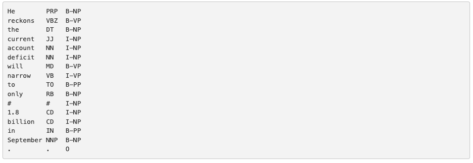
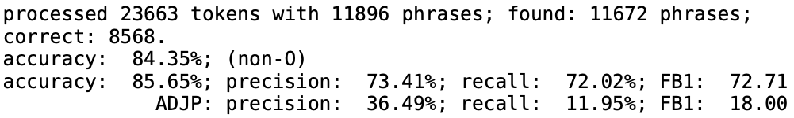
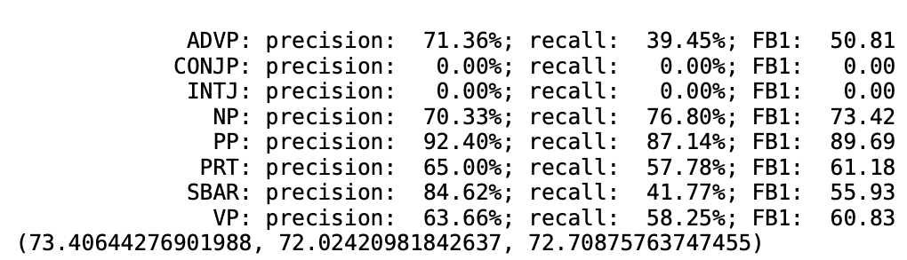
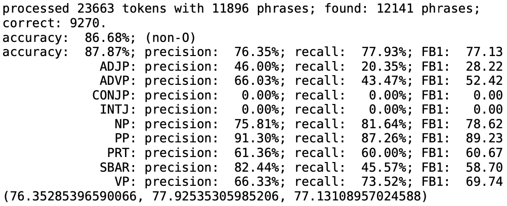
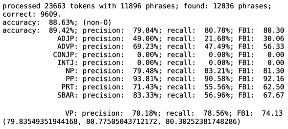

# Sequence Models And Machine Translation

The syntax of a natural language, similar to the syntax of a programming language involves the arrangement of tokens into meaningful groups. Phrasal chunking is the task of finding non-recursive syntactic groups of words.

## Data Set

The train and test data consist of three columns separated by spaces. Each word has been put on a separate line and there is an empty line after each sentence.    

The first column contains the current word, the second column is the part-of-speech tag for that word, and the third column is the chunk tag.   

Here is an example of the file format:

## Documentation 

The biggest change we made was through the semi-character RNN. As instructed for the baseline solution, we implemented this model to deal with noisy inputs. character_level_representation() is the baseline solution which simply creates 3 100 dimensional vectors. The first vector encodes the first character, the last vector encodes the last character, and the 3rd vector stores the character counts of all the other characters in between. Our second experimental implementation called character_level_representation_v2() was an extension of that work. In this function, we are extending that idea to encode the second, and second-to-last characters in their own vectors.    

Both of these functions also implement an idea that was in the "Combating Adversarial Misspellings with Robust Word Recognition" paper. In this paper, the authors suggest various backoff methods such as passing through the word, backing off to a neutral word, or backing off to a neutral model. We decided to implement the backoff to a neutral word model, and we chose the backoff word as "a". We hope that this will make the model more robust to the misspellings in the test set. Note that we also normalize the internal character count vector.
  

Note that we needed to implement some other small changes in the codebase to have these functions work. This meant that in the training function we created an encoded tensor and passed this into the forward function. In the forward function, this was concatenated to the embedding vector. Although single line changes, we are noting these here for your reference.    

## Analysis

The first iteration of the model was the default code. This resulted in the following scores. One of the notable places where this model underperformed was on the ADJP tags.

The next iteration of our model was a semi-character RNN to deal with noisy inputs. This was denoted in the character_level_representation() function above. One important thing to note is that we initially did not not normalize the internal character count, but normalizing this resulted in a small gain on the FB1 score. We can see that our correct count went from 8568 to 9270. We can also see that the FB1 score increased by almost 5 points. This iteration of the ended up being our 2nd highest-scoring solution.

The final and best model iteration was a last-minute improvement. After speaking with the professor in class, we found out that we are able to tune the biderctional parameter. We expected this to outperform our previous iterations, and it did not disappoint. The FB1 score improved by over 3 points. We hypthesize that this is because the model is able to use information from two directions rather than just one, and as a result is more accurate.

## Installation

Make sure you setup your virtual environment:

    python3 -m venv venv
    source venv/bin/activate
    pip install -r requirements.txt

You can optionally copy and modify the requirements for when we
test your code:

    cp requirements.txt answer/requirements.txt

## Required files

You must create the following files:

    answer/chunker.py
    answer/chunker.ipynb

## Create output.zip

To create the `output.zip` file for upload to Coursys do:

    python3 zipout.py

For more options:

    python3 zipout.py -h

## Create source.zip

To create the `source.zip` file for upload to Coursys do:

    python3 zipsrc.py

For more options:

    python3 zipsrc.py -h

## Check your accuracy

To check your accuracy on the dev set:

    python3 check.py

For more options:

    python3 check.py -h

In particular use the log file to check your output evaluation:

    python3 check.py -l log

The accuracy on `data/input/test.txt` will not be shown.  We will
evaluate your output on the test input after the submission deadline.

## Default solution

The default solution is provided in `default.py`. To use the default
as your solution:

    cp default.py answer/chunker.py
    cp default.ipynb answer/chunker.ipynb
    python3 zipout.py
    python3 check.py

Make sure that the command line options are kept as they are in
`default.py`. You can add to them but you must not delete any
command line options that exist in `default.py`.

Submitting the default solution without modification will get you
zero marks.

## Data files

The data files provided are:

* `data/sample_vec.txt` -- small sample word vector file
* `data/lexicons` -- different lexicons / ontologies used for retrofitting
* `data/input` -- input files `dev.txt` and `test.txt`
* `data/reference/dev.out` -- reference output for the `dev.txt` input file
